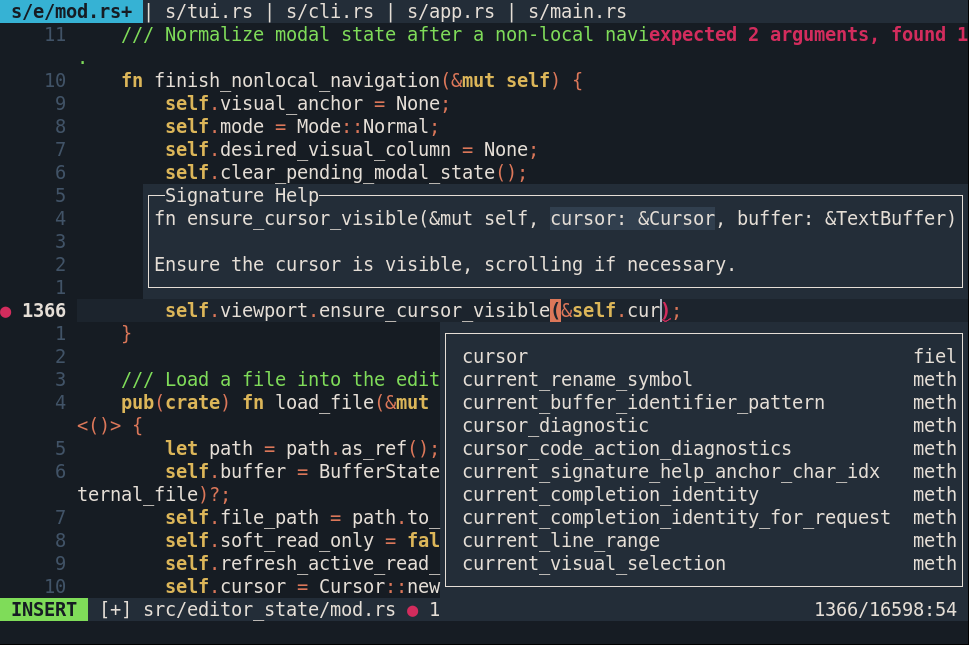
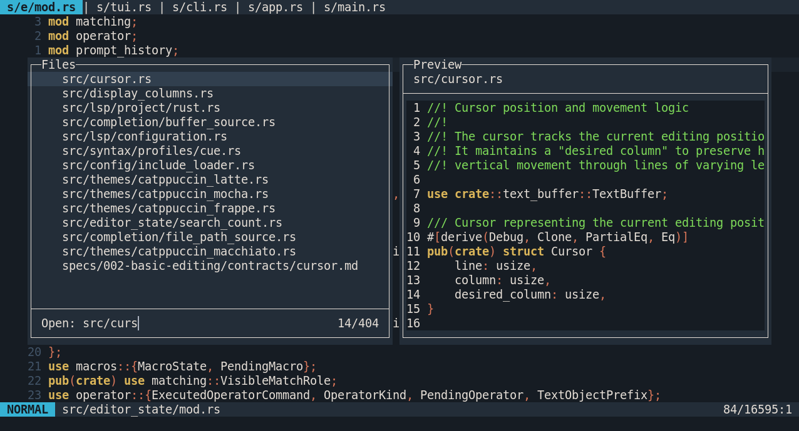
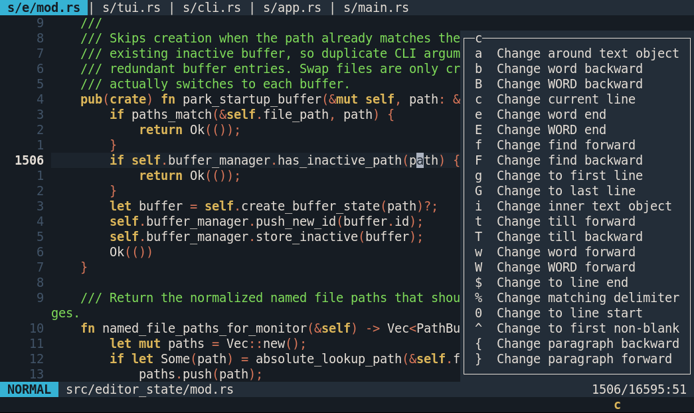

# Ordex

[](https://github.com/ordex-editor/ordex/actions)
[](https://ordex-editor.github.io/ordex/)


> **Note:** Significant portions of this project were designed and implemented with the help of advanced AI systems, blending automated code generation with human review and refinement.

> **Alpha warning:** This project is currently in alpha. Expect bugs, and use caution because document loss is possible.

A terminal text editor with vim-style keybindings.

## Platform and support status

- **Primary platform: Linux** with comprehensive CI coverage.
- macOS has CI with the same test suite as Linux. Some performance-sensitive tests use adjusted expectations due to CI runner characteristics.
- Windows is currently untested and may have partial or no support.
- Current support target is POSIX-compatible terminals with ANSI support.

## Highlights

- Modal editing with Vim-style navigation and operators
- Multi-buffer editing and quick buffer/file switching
- Built-in search, grep picker, and regex-based substitution
- LSP features for completion, navigation, diagnostics, and code actions
- Fuzzy file/buffer pickers with live previews on wide terminals

<details>
<summary>Screenshot</summary>


</details>

- Safety-focused workflows such as swap-file recovery and open-conflict prompts
- Key discovery popup

<details>
<summary>Screenshot</summary>


</details>

See the [full features documentation](docs/src/features.md) for complete details.

## Known limitations

- Ordex is not a full Vim replacement and intentionally follows its own scope.
- Search uses Rust regex syntax, so look-around and pattern-side backreferences are unavailable.
- Some LSP code-action kinds are not supported (command-driven/resource-operation actions).
- System clipboard features depend on external tools (`wl-copy`/`wl-paste` on Wayland or `xclip` on X11).

For detailed behavior and compatibility notes, see:

- [Features](docs/src/features.md)
- [Installation and Build](docs/src/installation.md)
- [Commands](docs/src/commands.md)
- [FAQ](docs/src/faq.md)
- [Troubleshooting](docs/src/troubleshooting.md)

## Documentation

- User guide source: `docs/`
- [Published docs site](https://ordex-editor.github.io/ordex/)

For local docs development:

```bash
mdbook build docs
mdbook serve docs
```

## Quickstart

Build:

```bash
cargo build --release
```

Run:

```bash
ordex [file...]
```

Example:

```bash
ordex README.md
```

Ordex can also be launched without a filename:

```bash
ordex
```

## Requirements

- Rust (stable)
- POSIX-compatible terminal with ANSI support
- Language-server binaries available on `PATH` for the languages you want to use
- `wl-copy` / `wl-paste` on Wayland or `xclip` on X11 for system clipboard support

## Development

Run checks locally:

```bash
cargo fmt --check
cargo clippy --all-targets --all-features -- -D warnings
cargo test
```
